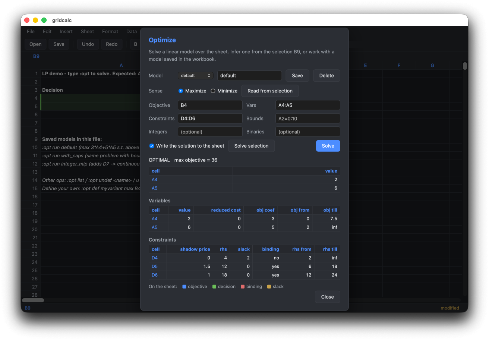

# Desktop app (web frontend)

An editable grid in a native desktop window, driven by the same engine as the terminal app. The engine runs in-process on CPython -- keeping the C++ extensions -- and a [pywebview](https://pywebview.flowrl.com/) window renders a viewport over it, calling Python directly across the `js_api` bridge. There is no server, no port, and no HTTP.

Both frontends read and write the same files, format cells through the same code, and share most of the `:` command set through a [frontend-neutral registry](https://github.com/shakfu/gridcalc/blob/main/src/gridcalc/commands.py), so `:sort` in the terminal and `Sort rows` in the palette are one implementation rather than two that drift. A conformance test fails if either frontend loses a shared command.

```sh
pip install 'gridcalc[web]'
gridcalc-web                    # demo workbook, or: gridcalc-web book.json
```

!!! note "From a source checkout, build the UI bundle first"

```text
`make web-build` compiles the React client into `src/gridcalc/web/static/index.html`, which `gridcalc-web` loads. It is a build artifact and is not in git, so a checkout that has not run it exits with a message telling you to. Released wheels and sdists ship the bundle already built -- `make wheel`/`make sdist` and every CI build job compile it first, and the release pipeline fails if a distribution is missing it.
```

## Editing

In-cell and formula-bar editing, keyboard navigation, rectangular selection by drag or shift-click, and clicking a row or column header to select the whole line. Copy/cut/paste (formula references adjust, `$` absolutes do not), fill down and right, undo/redo, insert and delete rows and columns sized to the selection. Sheets can be added, renamed, deleted, and reordered. Column edges drag to resize and the width is saved with the workbook. A status bar reports the selection's aggregates and an unsaved-changes marker; closing with unsaved work asks first.

**Formula point mode** works as it does in the terminal: while typing a `=` formula, clicking or dragging on the grid inserts the reference at the caret.

## Command palette and find

**Ctrl-K opens a command palette** over the whole command set, matched on subsequences (`fld` finds `Fill down`). It is the home for commands no menu would justify -- column width, named ranges, sort, formula mode, freeze panes, manual recalculation -- and prompts for arguments the way the `:` line does.

**Ctrl-F** finds text *or computed values*, so a formula is findable by its result as well as its source.

## Optimization

This is where the desktop app goes past the terminal. `Optimize` reads a model off a selected block or loads one saved in the workbook (the same models `:opt run` executes), solves it, and then **paints the result onto the sheet**: the objective, the decision cells, and each constraint marked binding or slack, with shadow prices and RHS ranging in the hover text. A shadow price means considerably more sitting on the constraint row it belongs to than in a column of cell references.

`Goal Seek` and a parametric `Sweep` -- the objective plotted against a constraint's right-hand side, breakpoints marked -- round it out.



*`gridcalc-web example_lp.json` after `Optimize`: the decision cells are green on the sheet behind the dialog, and the constraint table carries the shadow prices and the range each right-hand side may take before the basis changes.*

## Workbooks that carry code

A JSON workbook can hold a Python code block, and HYBRID and PYTHON mode formulas call into it. Opening one is a decision, not a default: the file loads *formulas only*, and a dialog reports what it would run -- the cell and formula counts, the modules it names split by how much is known about each, and the code itself. Nothing has been executed to produce any of that; the file is parsed, not run.

Three answers. **Run code** loads it and the sheet recalculates against it. **Formulas only** leaves it withheld, and cells that call into it keep their error state. **Cancel** loads nothing at all -- or, for a workbook named on the command line, leaves the formulas-only view already on screen. Modules that no list classifies need a second, separate answer: approving the file vouches for what the lists know about, and an unclassified module is unreviewed rather than known-safe. The reasoning is in the [security plan](security-plan.md); the curses frontend asks the same question at its own prompt.

Turning the sandbox off (`GRIDCALC_SANDBOX=0`, or `sandbox = false` in the config) removes the question along with the protection: the code loads unasked, as it does in the terminal.

## Not there yet

The object editor for Vec/ndarray/DataFrame cells, code-block editing (`:e`), pandas import/export, and `:move`/`:replicate`.

See the [web frontend design note](web.md) for the full parity table and [GUI direction](gui.md) for why this direction was chosen over the alternatives.
