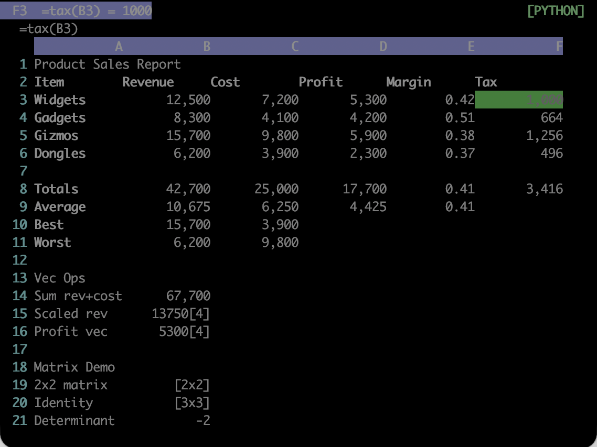

# Formula modes

Each workbook has one of three evaluation modes, controlling which formulas parse and what is reachable from them:

| Mode | Grammar | Python escape hatch | Sandbox | Use case |
|---|---|---|---|---|
| `EXCEL` | strict Excel | none | not needed (no `eval`) | xlsx interop, untrusted files |
| `HYBRID` | Excel + `py.*` | code-block functions reachable as `py.foo(...)` | code blocks only | most new sheets |
| `PYTHON` | Python `eval()` | full Python expressions | full AST sandbox | numpy/pandas-heavy work |

*`examples/example.json` in PYTHON mode. F3 calls `tax`, defined in the workbook code block with `:e`; the mode badge is top right.*

Switch with `:mode <name>`. The change is refused if any current formula does not parse in the target mode.

Files without an explicit `mode` field load as `PYTHON`, for backwards compatibility with workbooks written before modes existed. `:xlsx load` switches to `EXCEL` automatically, since an imported workbook's formulas are Excel formulas by definition.

The mode also decides which recalculation engine runs: EXCEL and HYBRID use a dependency graph derived from the parsed formula ASTs and evaluate in topological order, while PYTHON iterates to a fixed point. See [Topological recalc](../topological.md) for why, and [Security plan](../security-plan.md) for what the sandbox does on each path.
